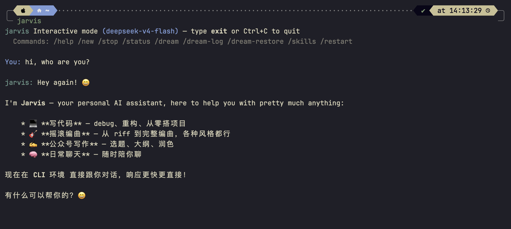

# Jarvis

<!-- markdownlint-disable-next-line -->


> **Inspiration** — Jarvis is a practical study and TypeScript reimplementation of [nanobot](https://github.com/simonw/nanobot), an agent framework that demonstrated a mature, production-grade memory and session architecture. I built Jarvis to deeply understand those patterns while applying them to a multi-channel, CLI-first workflow. If you find Jarvis useful, also check out nanobot — it's where the core ideas came from.

Personal AI assistant that connects LLMs to your tools and chat platforms. Built as a ReAct-loop agent with session memory, MCP server support, and a growing set of channel integrations.

## What it solves

Jarvis turns any LLM into a persistent, tool-augmented agent that:

- **Stays in context** — sessions persist across restarts; long-term memory survives via `Dream` consolidation
- **Works where you work** — integrates with Feishu, Discord, Telegram, Slack, Email, and more via a unified message bus
- **Speaks many LLMs** — DeepSeek, OpenAI, Anthropic, Azure, Ollama, OpenRouter, and 20+ providers through a single config
- **Plays well with others** — connects to any MCP server and exposes an OpenAI-compatible HTTP API so existing tools can use it

## Demo



## Install

```bash
# Bun (recommended)
bun install -g @kindred/jarvis

# npm
npm install -g @kindred/jarvis
```

Requires [Bun](https://bun.sh) >= 1.0.

## Quick Start

```bash
# Interactive CLI mode
jarvis agent

# Single message
jarvis agent -m "Explain what a ReAct agent is"

# OpenAI-compatible API server
jarvis serve -p 8000

# Start gateway with cron + heartbeat
jarvis gateway -p 18790

# Initial setup
jarvis onboard
```

## Configuration

Create `~/.jarvis/config.json`:

```json
{
  "agents": {
    "defaults": {
      "model": "deepseek-chat"
    }
  },
  "providers": {
    "deepseek": {
      "apiKey": "sk-...",
      "apiBase": "https://api.deepseek.com/v1"
    }
  }
}
```

Or use environment variables: `DEEPSEEK_API_KEY`, `ANTHROPIC_API_KEY`, `OPENAI_API_KEY`.

## Architecture

```
Incoming Message (CLI / API / Channel)
         │
         ▼
   ┌─────────────┐
   │ AgentLoop   │  ← Slash commands intercepted here (/help, /new, /stop...)
   └──────┬──────┘
          │ normal message
          ▼
   ┌──────────────────┐
   │ ContextBuilder   │  System prompt + session history + memory
   └──────┬──────────┘
          │
          ▼
   ┌──────────────────┐
   │  AgentRunner      │  ReAct loop: LLM → tools → result → repeat
   │  (ReAct Loop)     │
   └──────┬──────────┘
          │ tool calls
   ┌──────┴──────┐
   │ ToolRegistry│  ReadFile, WriteFile, Grep, WebSearch, MCP...
   └────────────┘
          │
          ▼
   ┌──────────────┐
   │ SessionStore  │  JSONL persistence
   └──────┬───────┘
          │ Dream triggered
          ▼
   ┌──────────────────┐
   │ Consolidator     │  Memory compaction + MEMORY.md update
   └──────────────────┘
          │
          ▼
   ┌──────────────┐
   │ OutboundMsg  │  Echo back / send to channel
   └──────────────┘
```

## Features

| Feature | Description |
|---------|-------------|
| **Multi-provider LLM** | DeepSeek, OpenAI, Anthropic, Azure, Ollama, OpenRouter, 20+ |
| **ReAct tool loop** | Files, web search, code execution, MCP servers |
| **Session persistence** | JSONL-based conversation history, survives restarts |
| **Memory consolidation** | `Dream` — triggers context compaction and writes to MEMORY.md |
| **Subagents** | Spawn parallel agent tasks via `/spawn` |
| **OpenAI-compatible API** | `jarvis serve -p 8000` — drop-in for any OpenAI client |
| **Channel integrations** | Feishu, Discord, Telegram, Slack, Email, and growing |
| **Cron service** | Scheduled tasks with cron expressions |
| **MCP support** | Connect any MCP server as tool provider |

## Slash Commands

In interactive mode, type `/` + Tab for autocomplete:

- `/help` — Show help
- `/new` — New conversation (clear session)
- `/stop` — Cancel running subagent tasks
- `/status` — Session statistics
- `/skills` — List available skills
- `/dream` — Trigger memory consolidation
- `/dream-log` — View consolidation history
- `/dream-restore <sha>` — Restore memory to a previous version
- `/restart` — Restart the process

## License

[MIT](LICENSE)